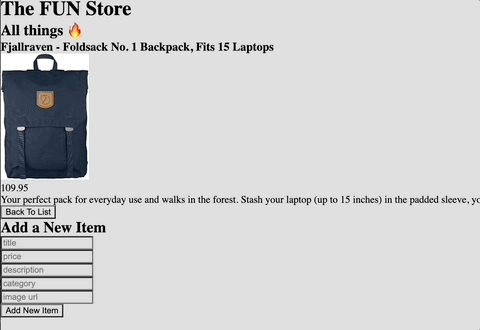

# inventory-app
A full-stack application to track your inventory

## Getting Started

1. `npm install`
2. `npm run seed`
3. `npm run server-dev`
4. In a seperate terminal, `npm run client-dev`

## Welcome to the FUN store! 

            

Welcome to the FUN store! The FUN store is a Full-Stack RESTful CRUD e-commerce web application, where the user can view an item and see a list of all of the items thats are available for purchase. Using React, Node, Express, Sequelize/SQL, HTML, and CSS, we have brought the FUN store to life! We carry various products from backpacks, bod jewelry, and clothing as well as any other item that you may need! 

## Collaborators 

This app was brought to you by the FUN crew: Dar-Ci Calhoun, Lauren Richardson, Serkadis Dubale, and Krystal Lopez. 
